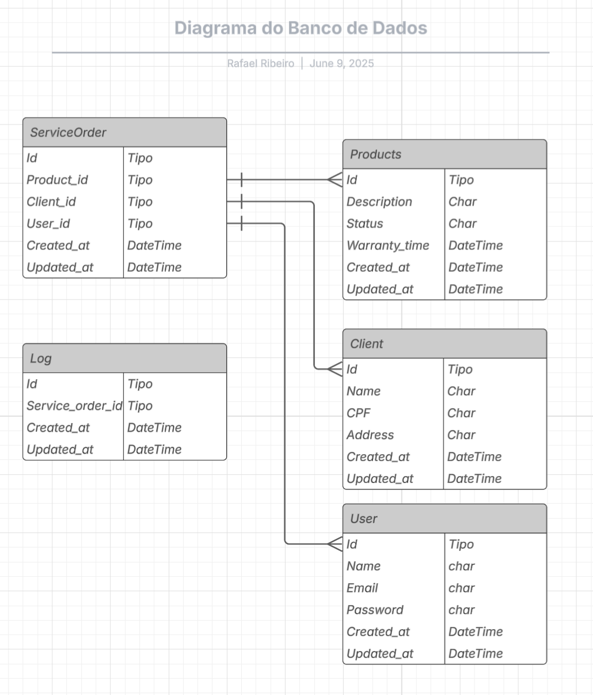

# Sistema de Ordem de Serviço

Este projeto é um sistema web desenvolvido para simular o fluxo de abertura de Ordens de Serviço, com funcionalidades de CRUD para Clientes e Produtos. Esta aplicação é parte de um teste prático para avaliação de um Programador Pleno.

---

## 🛠️ Tecnologias Utilizadas

- **Back-end:** PHP (Programação Orientada a Objetos, API RESTful)
- **Front-end:** HTML, JavaScript, jQuery, Bootstrap
- **Banco de Dados:** PostgreSQL
- **Controle de Versão:** Git

---

## 🚀 Como Rodar a Aplicação

### 1. Configurar Variáveis de Ambiente

Renomeie o arquivo `.env.exemple` para `.env`:

```bash
mv .env.example .env
```

### 2. Subir os Containers com Docker

Certifique-se de ter o **Docker** e **Docker Compose** instalados. Depois, execute:

```bash
docker-compose up -d
```

Esse comando iniciará os containers, incluindo o banco de dados PostgreSQL.

### 3. Criar as Tabelas do Banco de Dados

Após o banco estar em funcionamento, execute o script de migração para criar as tabelas necessárias:

```bash
php database/migrate.php
```

---

## 📦 Funcionalidades Implementadas

Atualmente, o projeto contém as seguintes funcionalidades:

### ✅ Clientes

- CRUD completo (Criar, Ler, Atualizar, Deletar)
- Validação de CPF (verifica se é válido e único)

### ✅ Produtos

- CRUD completo (Criar, Ler, Atualizar, Deletar)
- Filtros avançados por **status** e **tempo de garantia**

> ⚠️ As funcionalidades de Ordem de Serviço, autenticação com JWT, e sistema de logs ainda não foram implementadas nesta versão.

---

## 📂 Estrutura de Pastas

```
.
├── database/
│   └── migrate.php     # Script de criação das tabelas
├── public/
│   └── views/      # Tela de login / dashboard
├── .env.exemple        # Exemplo do arquivo de variáveis de ambiente
├── docker-compose.yml  # Container PostgreSQL
└── README.md
```

---

## 📌 Requisitos Futuramente Esperados

Ainda pendentes para desenvolvimento:

- Autenticação de usuários (JWT)
- Controle de acesso (admin, usuário comum)
- Finalizar o CRUD de Ordens de Serviço com auto-cadastro de cliente
- Sistema de logs para alterações nas ordens
- Testes unitários e de integração
- Documentação da API com Swagger

---

## ✅ Entrega

- Código versionado com Git
- README com instruções claras de configuração e execução
- Prazo de entrega: **3 dias**

---

## 🤝 Licença

Este projeto é de uso exclusivo para avaliação técnica. Entre em contato com o autor em caso de dúvidas.

## 🧾 Diagrama do Banco de Dados



## ✍️ Autor

**Rafael Ribeiro**  
Data: 11 de Junho de 2025